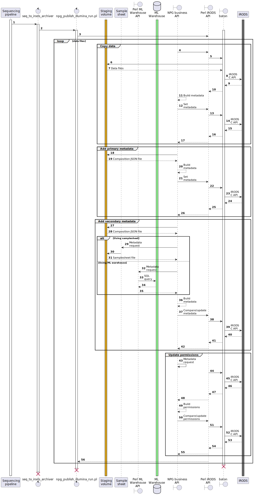

# Sequence diagrams

These sequence diagrams show the main components involved in publishing
biological data and associated metadata to iRODS.

## Editing the diagram

The diagrams are in [PlantUML](https://plantuml.com/) format, which may be
edited with any text editor. If your editor does not have a PlantUML plugin,
you can generate an image from the [Plant UML server](http://www.plantuml.com/plantuml/uml/XLDDJ-Cm4BtxLuouS25RYMEqGjfT4EAmIqNXrekR3CKY_i0VIFttQpjDF0v5lSKlRzxCl9cvVFFUk7QrCWDNFiZXHwVbok57GDLXqmk-jrmoneFNAiWTMiOCjrvqmiG0kFYtlj-gjJ0u28KNm1r4P7gpJYjlzN2aRS9kg_wyOVS-4ICYXS_GWlk4PbYG4pHIU-xvZZk46FziUKJgeiJJu-rcrCZ1-PrU9saReVO35kBuPj62a3D8uPpGgegz-_t0sDxgO61g5b9LC6ZUCs81D3SbVGlhu3EFySwBJ-wnici6Iy7p5pHHYP9xFAb1uA8IKHVDFLHCL3sRceZzWCkj2XTR9Lblg0MpDC7APo8dOoWonkSXjV1Y-XJiod_d8q1h9iAiNX2ef4ReLLkYLfbALukgZ_ioVKok4dOBz-ZFrNZSkgyLabd_wdig8z7pFFfwSBHEEf5hE22tOBJp3L7fCf5UmtbVvjHNMqNGD8khKT05MPbNJkrhqrNkdqr3aslrAgpaFWtZb67BkfTkvSjhEcqEM_MDNwMqUal9wRRmLt_YuixACTJGyThd2ocyD8t_)
